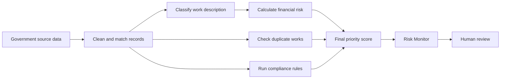
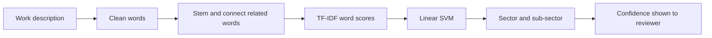
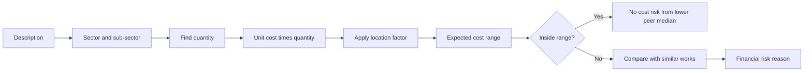
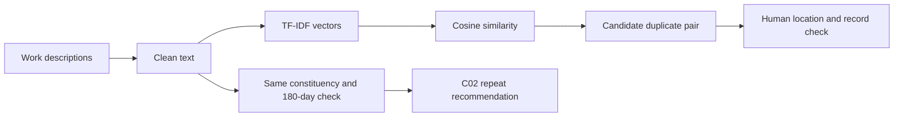
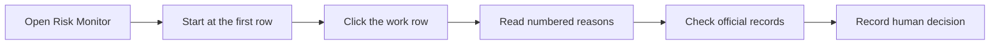

# NIRIKSHAN AI Project Reference Guide

This guide explains what the project does, why it is used, how every model and rule works, and how a reviewer should use the website.

## 1. Purpose

NIRIKSHAN AI is an MPLADS monitoring and review tool. It reads work descriptions, dates, sanctioned amounts, expenditure, progress, location, and related records. It highlights records that need human checking and explains why.

It is a decision-support system. A high score is not proof of fraud.

## 2. Complete Workflow



### What happens at each step

1. **Source data:** recommendations, sanctions, completions, and expenditure are loaded.
2. **Cleaning:** work IDs, dates, amounts, names, locations, and descriptions are standardized.
3. **Classification:** the description is assigned to a sector and sub-sector.
4. **Scoring:** financial, duplicate, compliance, and material context checks are calculated.
5. **Final priority:** all scores are combined into one review score.
6. **Review:** Risk Monitor shows the highest-priority work first.

## 3. Data Used

| Data | Used for |
|---|---|
| Recommended works | Recommendation date, description, repeat-work check |
| Sanctioned works | Sanction date, sanctioned amount, state, constituency |
| Completed works | Completion date and completion status |
| Expenditure records | Spending and progress checks |
| Sector cost reference | Expected cost by sector, sub-sector, quantity, and location |

## 4. Work Classification Model



### Models and conditions

- **Text cleaning:** makes words consistent and removes unnecessary text.
- **Vocabulary matching:** connects related words such as `light`, `lights`, and `lighting`.
- **TF-IDF:** gives more importance to words that help identify the type of work.
- **Linear SVM:** chooses the most likely sector and sub-sector from learned word patterns.
- **Confidence:** shows how strongly the description supports the selected class. It is not proof that the classification is correct.
- **Quantity reading:** finds numbers and units such as `9 poles`, `3 lights`, `1 km`, and `2 rooms`.

## 5. Financial Anomaly Model



### Financial calculations

1. **Expected total:** reference unit cost × quantity × location multiplier.
2. **Expected range:** used when the exact subtype is not certain.
3. **Peer median:** the middle sanctioned amount among similar sector and state works.
4. **Peer ratio:** sanctioned amount ÷ peer median.
5. **Percentile:** shows how high the amount is compared with similar works.
6. **IQR upper limit:** `Q3 + 1.5 × (Q3 - Q1)` identifies unusually high amounts.
7. **Isolation Forest:** checks amount, expenditure, peer ratio, payment count, and expenditure-to-sanction ratio together.

Important condition: if a quantity-based expected range exists and the cost is inside it, the work is not marked financially risky only because the broad peer median is lower.

## 6. Compliance Rules

Compliance has the highest weight in the final score because it checks dates, progress, required records, and approved money.

| ID | Rule | Condition | Result |
|---|---|---|---|
| C01 | Recommendation to sanction | More than 45 days | Critical |
| C02 | Repeat recommendation | Similar work and location within 180 days | Critical |
| C03 | Minimum completion window | Completed in under 15 days | Critical |
| C04 | Normal completion window | Completed from 15 days to 1 year | Compliant |
| C05 | No progress after 1 year | No completion or recorded progress | Anomaly |
| C06 | Extended completion window | Partial progress within 18 months | Monitor |
| C07 | Beyond 18 months | Partial-progress work still incomplete | Critical |
| C08 | Date consistency | Recommendation <= sanction <= start <= completion | Warning or critical |
| C09 | Expenditure consistency | Spending is above sanctioned amount | Warning or critical |
| C10 | Invalid financial data | Negative or impossible values | Data quality |
| C11 | Required information | Critical fields are missing | Data quality |
| C12 | Completion consistency | Status and completion date disagree | Data quality |

Image verification is optional. A missing image does not create a compliance failure by itself.

## 7. Duplicate and Repeat Work Checks



- Similar descriptions are compared within the same constituency.
- A high similarity is only a candidate, not a confirmed duplicate.
- C02 flags a similar normalized description in the same or similar location within 180 days.
- The Duplicate Inspector shows the pair so the reviewer can compare dates, location, amount, and purpose.

## 8. Final Risk Score

The final score is a review priority, not a finding of wrongdoing.

```text
Composite = 0.40 × Compliance
          + 0.35 × Financial
          + 0.23 × Duplicate
          + 0.02 × Material context
```

| Part | Weight | Meaning |
|---|---:|---|
| Compliance | 40% | Date, progress, required-field, status, and money checks |
| Financial | 35% | Cost compared with expected cost and similar works |
| Duplicate | 23% | Similarity with another work description |
| Material context | 2% | Supporting price context |

Risk levels:

- **LOW:** below 35
- **MEDIUM:** 35 to 64
- **HIGH:** 65 to 84
- **CRITICAL:** 85 and above

## 9. Website Screens

| Screen | Purpose |
|---|---|
| Overview | Portfolio totals, risk by sector, and state summaries |
| Risk Monitor | Highest-priority works first; click a row to open details |
| Projects | Searchable directory in cards or table view |
| Duplicate Inspector | Similar work pairs and the 180-day repeat check |
| Analytics | Financial, duplicate, and compliance patterns |
| Methodology | Models, rules, weights, and limits |

## 10. Reviewer Workflow



Review in this order:

1. Compliance reason
2. Financial reason
3. Duplicate reason
4. Supporting material context

Check dates, quantity, location, sanction, expenditure, progress, evidence, and related works before making a decision.

## 11. Running the Website

From `P:\SIH\mplads-main`, open two terminals.

Terminal 1:

```powershell
npm run backend
```

Terminal 2:

```powershell
npm run frontend
```

Open `http://localhost:3000`.

Backend API: `http://127.0.0.1:8000`.

To rebuild analytical outputs after changing data or rules:

```powershell
npm run pipeline
```

## 12. Main Code Files

| File | Purpose |
|---|---|
| `src/data/master_builder.py` | Builds the master analytical dataset |
| `src/modules/sector_classifier.py` | Assigns sector and sub-sector |
| `src/modules/financial_anomaly.py` | Calculates financial risk |
| `src/modules/duplicate_detection.py` | Finds similar descriptions |
| `src/modules/compliance_engine.py` | Runs C01 to C12 |
| `src/risk/composite_risk_engine.py` | Combines scores and creates reasons |
| `src/backend/app.py` | Serves dashboard API data |
| `frontend/` | Website screens and interactions |
| `data/features/` | Generated analytical outputs |

## 13. Important Limits

- A high score means unusual or incomplete information, not proven fraud.
- Results depend on the quality of the source records.
- Similarity requires human verification.
- Images are optional and are never invented by the system.
- Model confidence describes text matching, not the truth of a project.
